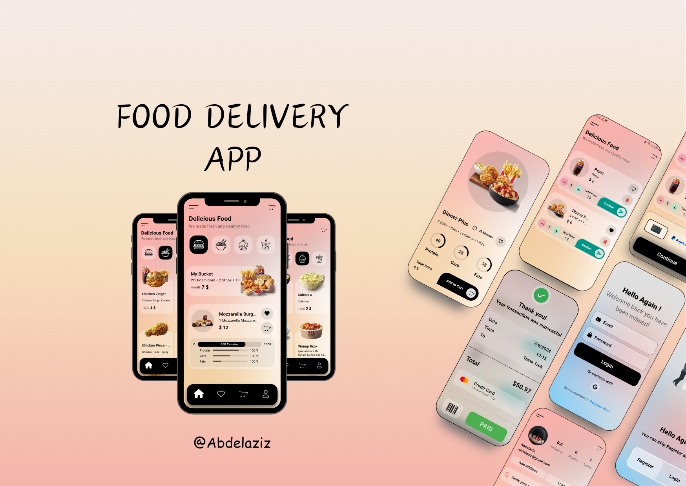

EzEat  
( Food Delivery App - using “API & Firebase” )
- Users : any one can register or authenticate with google account.
- Display food and drinks.
- Display calories, fats and protein for each food or drink.
- Each user have a favourite and cart list.
- User can create multiple delivery point card.
- Users can make order and pay by credit card “Stripe or paypal”.
- User can access food and drinks offline

🔗 check the link to see the full video in Linkedin 
[Linkedin Post](https://www.linkedin.com/posts/abdelaziz-elsayed-aab278252_flutter-flutterdev-mobiledevelopment-activity-7240379832872660993-yXhm?utm_source=share&utm_medium=member_desktop)

